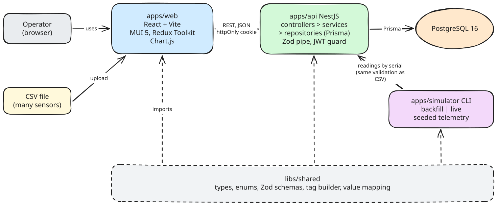

# Architecture

How the parts of the application fit together. The stack choices are recorded in
[docs/adr](adr/README.md); the data model in [domain-model.md](domain-model.md).



The diagram source is [architecture.excalidraw](architecture.excalidraw), editable at
[excalidraw.com](https://excalidraw.com).

## Components

| Component | Role |
|---|---|
| `apps/web` | The screens: login, overview, sectors, machines, monitoring points, charts and CSV import. Global state in Redux Toolkit, every API call a thunk. |
| `apps/api` | The only entry point to the database. Authenticates, validates at the edge, applies the business rules and serves the REST endpoints. |
| `apps/simulator` | A command-line client that plays the role of the sensors: it logs in, discovers the installed sensors and sends telemetry through the API. |
| `libs/shared` | What must be identical on every side: types, enums, Zod schemas, the tag builder and the value mapping between API and database. |
| PostgreSQL 16 | Persistence, and the last line of every rule through keys, foreign keys and `CHECK` constraints. |

The simulator reaches the database only through the API. It is one more client, so
simulated readings go through exactly the validation a CSV upload goes through.

## Workspace layout

```
condition-monitor/
  apps/
    web/              React + Vite
    api/              NestJS
      prisma/         schema.prisma and migrations
    simulator/        command-line application
  libs/
    shared/           code shared by the three apps
  docs/               README companions: assumptions, domain model, architecture, ADRs
  docker-compose.yml  PostgreSQL for development and for integration tests
```

Nx boundary rules allow each app to import `libs/shared` and nothing from another app.

## Inside the API

A request crosses the layers in one direction:

1. The **JWT guard** rejects the request unless it carries a valid session cookie or the
   route is marked public.
2. The **validation pipe** checks body and query against the shared Zod schema and
   answers `422` naming the field before any query runs.
3. The **controller** extracts what the service needs and calls it.
4. The **service** applies the business rules, such as the sensor model allowed for the
   machine type.
5. The **repository** is the only layer that talks to Prisma, and every query is scoped
   to the authenticated user.

Errors raised in any layer, including constraint violations from the database, are
translated into HTTP responses in one place, so a rejected `CHECK` reaches the client as
a readable `409` or `422` instead of a `500`.

## A CSV import, step by step

1. The operator selects a file on the import screen, and the web app uploads it.
2. The API reads the header and checks encoding, separator and decimal mark (C12). A
   file saved with semicolons and decimal commas is rejected here.
3. Each line is validated with the shared schema: timestamp with offset, known
   quantity, axis rule, finite value.
4. Serial numbers are resolved to monitoring points of the authenticated user. Unknown
   serials, including those of other users, are errors.
5. Readings are compared with what is already stored: the same value is counted as
   repeated, a different value is a conflict.
6. If any line failed, the whole file is rejected with `422` and the list of errors by
   line. Nothing is written.
7. Otherwise, in one transaction, missing series are created and new readings inserted.
8. The response reports, per sensor, the series created, the readings inserted and the
   repeated readings ignored.

The simulator sends the same content as JSON and joins this flow at step 3.

## Development environment

- PostgreSQL runs in Docker Compose, with a separate database for integration tests.
- The web app's development server proxies API calls, so the browser sees one site and
  the `SameSite=Strict` session cookie is sent ([ADR 0008](adr/0008-jwt-cookie-authentication.md)).
- The seed creates the fixed user and the `DRY` sector.
