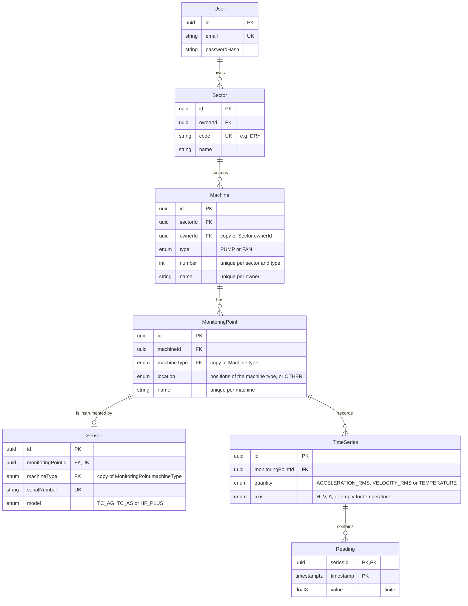

# Domain model

The entities, their relations and the rules the database enforces. The reasoning
behind each rule is in [assumptions.md](assumptions.md), referenced by item.

## Context

The application monitors rotating machines in a pulp and paper mill. The starting
scope is the drying section of a paper machine, where two kinds of equipment are
typical:

- **Pumps**, such as the condensate pumps of the dryer cylinders' steam system.
- **Fans**, such as the hood exhaust fans that remove hot, humid air from the dryer
  hood. Fibre and condensate build up on the blades, and unbalance is their most common
  fault.

Both are motor-driven sets. Their bearings are numbered along the power flow, from the
motor's free end to the driven equipment, and a sensor is mounted on each bearing
housing that matters. A pump also gets a position at the mechanical seal (B11). Each
sensor measures triaxial vibration and temperature, and the stored time-series are
telemetry: one scalar value per quantity and direction over time (C9).

## Entities

Every table except `Reading` also has `createdAt` and `updatedAt`, left out of the
diagram for readability. Primary keys are UUIDs, which reveal neither volume nor the
identifiers of other records. A reading has no identifier of its own: series and
timestamp already identify it, and an extra key would cost space in the largest table
for no answer.

## Constraints

| Rule | How the database enforces it | Assumption |
|---|---|---|
| Sector code unique across the system | unique index on `Sector.code` | B9, B10 |
| Machine tag unique across the system | unique index on `(sectorId, type, number)` | B10 |
| Machine number positive | `CHECK (number >= 1)` | B10 |
| Machine name unique per owner | unique index on `(ownerId, name)` | B2 |
| Machine owner equals its sector's owner | composite foreign key, see below | A4 |
| Sector with machines cannot be deleted | `ON DELETE RESTRICT` from `Machine` to `Sector` | B9 |
| Monitoring point name unique per machine | unique index on `(machineId, name)` | B2 |
| Position belongs to the machine type | `CHECK` on `MonitoringPoint`, see below | B11 |
| Position unique per machine, except `OTHER` | partial unique index on `(machineId, location) WHERE location <> 'OTHER'` | B11 |
| At most one sensor per monitoring point | unique index on `Sensor.monitoringPointId` | B3 |
| Serial number unique across the system | unique index on `Sensor.serialNumber` | B4 |
| No `TcAg` or `TcAs` sensor on a pump | `CHECK` on `Sensor`, see below | B15 |
| One series per point, quantity and axis | unique index on `(monitoringPointId, quantity, axis) NULLS NOT DISTINCT` | C1 |
| Temperature has no axis; vibration has one | `CHECK ((quantity = 'TEMPERATURE') = (axis IS NULL))` | C10 |
| One reading per series and timestamp | primary key `(seriesId, timestamp)` | C5 |
| Reading value is finite | `CHECK` rejecting `NaN`, `Infinity` and `-Infinity` | C4 |
| Deleting a machine removes what it owns | `ON DELETE CASCADE` from points down to readings | B6 |

`NULLS NOT DISTINCT` matters on the series index: without it, two temperature series
on the same point would not collide, because SQL does not consider two nulls equal.
It requires PostgreSQL 15 or later.

## Rules that span tables

Three rules depend on a value that lives in another table: the machine's owner comes
from its sector, and both the allowed positions and the allowed sensor models depend on
the machine type. A plain `CHECK` only sees its own row, so the value is copied down
the chain, and a composite foreign key keeps each copy equal to its source:

- `Machine (sectorId, ownerId)` references `Sector (id, ownerId)`.
- `MonitoringPoint (machineId, machineType)` references `Machine (id, type)`, with
  `ON UPDATE CASCADE`.
- `Sensor (monitoringPointId, machineType)` references
  `MonitoringPoint (id, machineType)`, with `ON UPDATE CASCADE`.

With the copy in the row, each rule becomes a local `CHECK`:

- On `MonitoringPoint`: the location is `OTHER`, or a pump position under `PUMP`, or a
  fan position under `FAN`.
- On `Sensor`: `machineType = 'PUMP'` is not allowed with model `TC_AG` or `TC_AS`.

The cascade covers both directions of each rule. Creating a `TcAg` sensor on a pump
fails the sensor's `CHECK`. Changing a machine from `FAN` to `PUMP` propagates the new
type down the chain; if any point holds a fan position or any sensor a `TcAg` or
`TcAs` model, a `CHECK` fails and the whole update rolls back (B5). The API validates
first and answers with the list of offending points; the database is the last line.

A trigger could express the same rules. It was not chosen for three reasons:

- **Concurrency.** A trigger that reads another table sees only committed data. Two
  concurrent transactions, one changing a machine to `PUMP` and one adding a `TcAg`
  sensor to it, would each see the old state and both commit. With the composite key,
  adding the sensor locks the referenced point row, and the cascaded type change needs
  the same row, so PostgreSQL serializes them and the second one fails its `CHECK`.
- **Coverage.** A trigger must handle every path that can break the rule: new sensor,
  model change, machine type change, a sensor moved to another point, a point moved to
  another machine. Forgetting one fails silently. With the copy, any path that changes
  the relation must keep the copy equal to its source, so all paths are covered without
  listing them.
- **Visibility.** Composite foreign keys appear in the Prisma schema, where a reviewer
  looks. A trigger lives only in migration SQL.

The cost is one duplicated column per table and `CHECK` constraints written in SQL in
the migrations, since Prisma does not model them.

## Derived, not stored

| Value | Derived from | Why it is not stored |
|---|---|---|
| Machine tag, e.g. `DRY-FAN-01` | sector code, type and number | a stored tag would go stale when a sector code is edited |
| Unit of a series | its quantity (C10) | a stored unit could be spelled differently for the same quantity |
| Series display name, e.g. "Velocity RMS, horizontal" | quantity and axis | it is presentation, not data |

Each of these is built in one place, the shared library, and used by both the API and
the interface. Sorting by tag means sorting by sector code, type and number.

## Value mapping

The challenge and the API use `Pump`, `Fan`, `TcAg`, `TcAs` and `HF+`. The database
enums use `PUMP`, `FAN`, `TC_AG`, `TC_AS` and `HF_PLUS`, because `HF+` is not a valid
enum identifier. The mapping lives only in the shared library.
